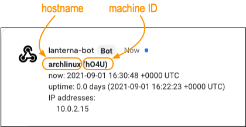

# 🏮 Lanterna - a small light in the dark 🏮

Lanterna collects the IP addresses of the host on which it is running and publishes them to a remote sink (instant message chat).

If you want to connect to a remote host and:

- the host has a dynamic IP address (that is: it can change, for example DHCP)
- the host doesn't have a DNS name
- the host is directly reachable (no NAT)
- the host can reach an always running destination (eg: a chat system)

then you can use `lanterna` to get the current IP address of the host and thus you will always be able to connect to it.

Once configured to run as a service, it will send a message each 24h.

# Usage

```
$ lanterna -h
Usage: lanterna [--config PATH] <command> [<args>]

Options:
  --config PATH          Path to configuration file [default: ./config.json]
  --help, -h             display this help and exit

Commands:
  collect                Collect IP addresses and print them
  init                   Create a configuration file
  run                    Collect IP addresses and send them
```

Then explore each command with:

```
$ lanterna <command> -h
```

# Sink types

Currently, the only supported type is `gchat` (Google Chat).

The message contains enough information to distinguish which host it is:



# Supported platforms

Tested on Linux and macOS, should run on any UNIX-like system. Should also run on Windows, but I have never tried.

# Installation

1. Install [Go](https://golang.org/dl/).
2. Install [Task](https://taskfile.dev/).
3. Build (output will be in the `bin/` directory):
   ```
   task build
   ```

## Create a room in Google Chat

1. Create a room, for example `lanterna-checkins-<USER>`, where `<USER>` is your name.
2. Click on "Manage webhooks", create one.
3. Name it `lanterna-bot` (or anything you prefer).
4. Copy the webhook URL. Keep it secret!

## Configure lanterna

1. Run `lanterna init`; it will create the configuration file in the current working directory
2. Edit the file with proper values; paste the webhook from the previous section.

## Install

   ```
   sudo cp ./bin/lanterna /usr/local/bin/lanterna
   ```

## Add to systemd

- Start with the sample [lanterna.service](doc/lanterna.service) unit file and edit it if needed.
- Create a user dedicated to run lanterna (security best practice):
  ```
  sudo useradd -r -s /usr/bin/nologin lanterna
  ```
- Add yourself to the lanterna group, so that you can edit the configuration file without having to use sudo:
  ```
  sudo gpasswd -a $(whoami) lanterna
  ```
- Install the lanterna unit file:
  ```
  sudo cp doc/lanterna.service /etc/systemd/system/
  ```
- Install the lanterna configuration file:
  ```
  sudo mkdir -p /usr/local/etc/lanterna &&
  sudo mv config.json /usr/local/etc/lanterna/ &&
  sudo chown lanterna:lanterna /usr/local/etc/lanterna/config.json &&
  sudo chmod 0660 /usr/local/etc/lanterna/config.json
  ```
- Verify permissions:
  ```
  ls -l /usr/local/etc/lanterna/config.json
  -rw-rw---- 1 lanterna lanterna    /usr/local/etc/lanterna/config.json
  ```
- Enable lanterna to start at boot
  ```
  sudo systemctl enable lanterna.service
  ```
- Start lanterna
  ```
  sudo systemctl start lanterna.service
  ```

### Security notice

- The unit file runs lanterna as the `lanterna` user.
- The configuration file `/usr/local/etc/lanterna/config.json` contains secrets (the credentials for the webhook), this is why we set it so only user `lanterna` and group `lanterna` can read it.

## Troubleshooting / looking at logs

Status:

```
systemctl status lanterna.service
```

Logs:

```
sudo journalctl -e -u lanterna.service
```
